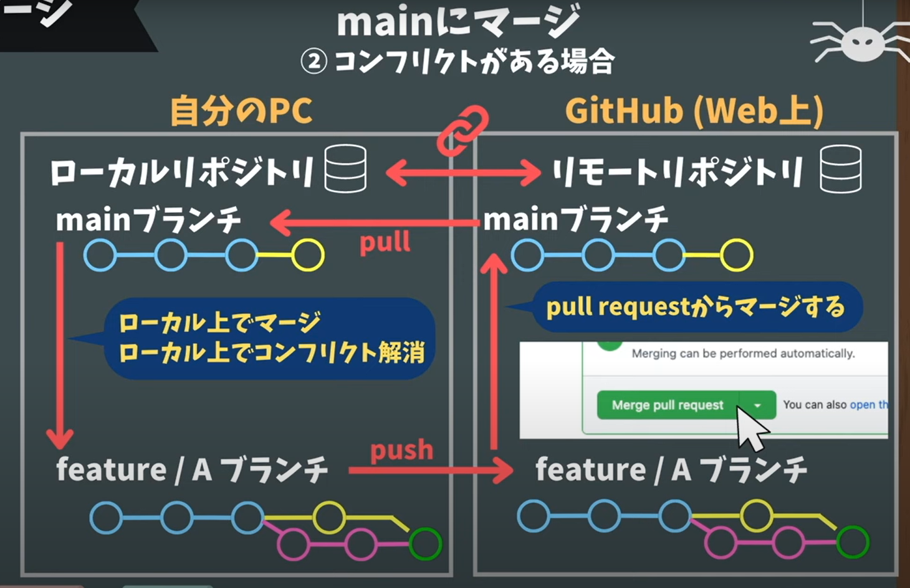

# Gitの流れ
参照  
[【GitHub入門】Webアプリを作りながらGitHub開発フローを習得してみよう](https://www.youtube.com/watch?v=cOTBf8bHsXo)  
[【GitHub入門】初心者向け！GitHubでチーム開発するための基本操作を解説！](https://www.youtube.com/watch?v=Dz95iUNt-fg)
    
# <リモート、ローカルともまったくのゼロから始める場合>
## 1.リモートリポジトリの作成
  
①　Githubの右上「＋」―「New Repositry」―「Create a new repository」

②　「Repository name」にリポジトリの名前をつける。

③　PublicかPrivateを選択

④　ボタン「Create repository」を押し、空のリモートリポジトリを作成する。  
　　後で「Quick setup」のURLをコピーするため、そのまま開いておく。

⑤　VSCのターミナル（Git Bash）を起動し、ローカルリポジトリを置くディレクトリ（の親ディレクトリ）に移動

⑥　先ほど作成した空のリモートリポジトリをローカルにクローンする。  
　　Github上の「Quick setup」のURLをコピーし、ターミナルに`git clone URL`と貼り付けて実行

⑦　リポジトリ名の新しいディレクトリができているので、そこに移動し、`code .`で編集用のウィンドウを立ち上げる

⑧　ファーストコミットをpushしてみる。  
　　ターミナルで`git commit --allow-empty -m "first commit"`を実行し、`git push origin main`

## 2,ブランチを切る

①　現在いるブランチを確認する  
　　ターミナルで`git branch`を実行し、mainブランチにいることを確認する

②　新たに作業用のブランチを切る  
　　ターミナルで`git branch base`を実行し、baseブランチを作成する  
　　（`git checkout -b base`を実行してブランチの作成と切り替えを一気に行うことも可能。その場合③の作業は不要に）

③　作業用ブランチに移動する  
　　ターミナルで`git checkout base`を実行し、baseブランチに切り替える

④　コードを書く  
　　編集用のウィンドウでコードを編集する

## 3.プルリクをする

①　ステージに上げる  
　　ターミナルで　`git add *`　か　`git add .`　か　`git add -A` を実行する

②　コミットする  
　　ターミナルで`git commit -m "completed base"`を実行する

③　作業用ブランチをプッシュする  
　　ターミナルで`git push origin base`

④　Github上でプルリクエストをする  
　　リモートリポジトリでpushを確認し、「Compare & pull request」ボタンを押す  
　　タイトルと内容を書き込み「Create pull request」ボタンを押す

## 4.レビューし、マージする

①　上部の「Files changed」タブを押してコードの編集状況を確認する。

②　OKなら上部の「Conversation」タブを押して表紙に戻り、「Write」欄に「実装お疲れさまでした」などのコメントを入れて、「Comment」ボタンを押して確定した後、「Merge pull request」ボタンを押す。さらに「Confirm merge」ボタンを押す。mainブランチに作業用ブランチを合体させることができた。

③　マージできたら「Pull request successfully merged and closed」という欄に「Delete branch」のボタンが出るので、押して作業用ブランチを削除しておく。

## 5.ローカルの作業用ブランチを削除する

①　先ほど削除したのはリモートの作業用ブランチなので、今度はVSCに戻り、ローカルの作業用ブランチを削除する。VSCのターミナルに`git checkout main`でメインブランチに移動し`git branch`で移動を確認する。

②　`git branch -D <削除するブランチ名>`で作業用ブランチを削除する。`git branch`で削除を確認する。

## 6.mainブランチをローカルにプルする

①　作業用ブランチを削除したローカルの作業用ディレクトリには何もない状態になるので、ターミナルに`git pull origin main`と打ち込み、リモートからマージしたメインブランチをローカルに引っ張ってくる。
     
# ＜すでにPCにあるコードをGitHub上で管理したい場合＞
## 1.リモートリポジトリの作成
  
①　Githubの右上「＋」―「New Repositry」―「Create a new repository」

②　「Repository name」にリポジトリの名前をつける。

③　PublicかPrivateを選択

④　ボタン「Create repository」を押し、空のリモートリポジトリを作成  
　　後で「Quick setup」のURLをコピーするため、そのまま開いておく。

## 2.ローカルリポジトリの作成

⑤　VSCのターミナル（Git Bash）を起動し、コードを記述したファイルのあるディレクトリに移動

⑥　`git init`を打ち込み、ローカルリポジトリを作成する

⑦　`git add *`　か　`git add .`　か　`git add -A` を実行する

⑧　`git commit -m "＜コメント＞"`を実行する

## 3.ローカルリポジトリをリモートリポジトリにひもづける

①　Github上の「Quick setup」のURLをコピーし、ターミナルに`git remote add origin <URL>`を打ち込みリモートのURLをoriginにひもづける

②　`git push origin main`でリモートにアップロードする

    
# ＜GitHub上のコードをダウンロードして編集したい場合＞

## 1.リモートリポジトリからダウンロードする

①　VSCのターミナル（Git Bash）を起動し、ダウンロードしたいローカルのディレクトリに移動

②　GitHubのリモートリポジトリの緑色の「code」ボタンを押してURLをコピー

③　念のためリモートリポジトリのデフォルトのブランチがmainかどうか確認する  
　　「Settings」ボタンを押し、左欄の「Branches」を選ぶと「Default branch」を確認できる

③　ターミナルに`git close ＜URL＞`を打ち込み実行するとダウンロードされ、ひもづけも完了する

    
# ＜ブランチの運用＞

## 1.要点

▽mainブランチが一つと機能ごとに作られた複数のfeatureブランチで構成したモデルとする

▽mainブランチはプロダクトしてリリースするためのブランチ

▽重要なのはリモートのmainブランチが正式版。ローカルのmainブランチは勝手にリモートのmainと同期されない。新しいブランチを切る時は必ずローカルのmainブランチがリモートのmainブランチと同じ、つまり最新状態になっているか確認し、なっていなければpullで最新にしてからブランチを切る。

▽featureブランチは１ブランチにつき、１機能の開発、１つのバグ修正など１つの区切りよく開発できる単位で作る。

▽編集の履歴として残しておきたいタイミングで細目にコミットしていき、リモートのfeatureブランチにpushする。この時、リモートとローカルのfeatureブランチの名前を同じにする。

▽pushの際、`git push origin HEAD`と打ち込むとわざわざブランチ名を打ち込まなくて便利。

▽pushはコミットよりもう少し区切りのよいタイミングで実施する

## 2.コンフリクトが起きた場合

①　プルリクエストの際、「This branch has conflicts that must be resolved」（コンフリクトが起きている）とメッセージが出たら、安全のため、ウェブ上ではコンフリクトを解消しない。

②　作業するブランチをmainに切り替える  
　　VSCのターミナル（Git Bash）で`git checkout main`を打ち込む

③　ローカルのmainブランチを最新にする  
　　`git pull origin main`を打ち込み、mainブランチを更新

③　featureブランチに切り替える  
　　`git checkout feature....`でfeature....ブランチに切り替え

⑤　feature...ブランチに対してmainブランチをマージ（リモートでのマージと逆なので注意）  
　　`git merge main`でマージ

⑥　コンフリクトを解消する

⑦　`git add`、`git commit`、`git push`をする  
　　`git add -A` をして `git commit -m "fix conflict"` をして　`git push origin feature....`　をする

⑧　Github上でプルリクエストをする  
　　リモートリポジトリでpushを確認し、「Compare & pull request」ボタンを押す  
　　タイトルと内容を書き込み「Create pull request」ボタンを押す

⑨　レビューし、マージする  
　　上部の「Files changed」タブを押してコードの編集状況を確認する。

⑩　OKなら上部の「Conversation」タブを押して表紙に戻り、「Write」欄に「実装お疲れさまでした」などのコメントを入れて、「Comment」ボタンを押して確定した後、「Merge pull request」ボタンを押す。さらに「Confirm merge」ボタンを押す。mainブランチに作業用ブランチを合体させることができた。

⑪　マージできたら「Pull request successfully merged and closed」という欄に「Delete branch」のボタンが出るので、押して作業用ブランチを削除しておく。

⑫　ローカルの作業用ブランチを削除する  
　　先ほど削除したのはリモートの作業用ブランチなので、今度はVSCに戻り、ローカルの作業用ブランチを削除する。  
　　VSCのターミナルに`git checkout main`でメインブランチに移動し`git branch`で移動を確認する。

⑬　`git branch -D <削除するブランチ名>`で作業用ブランチを削除する。`git branch`で削除を確認する。

⑭　mainブランチをローカルにプルする  
　　作業用ブランチを削除したローカルの作業用ディレクトリには何もない状態になるので、ターミナルに`git pull origin main`と打ち込み、リモートからマージしたメインブランチをローカルに引っ張ってくる。